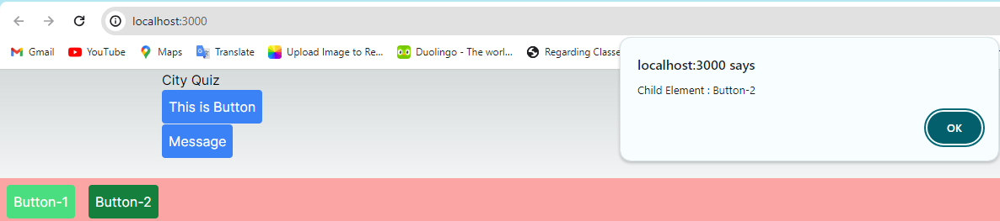
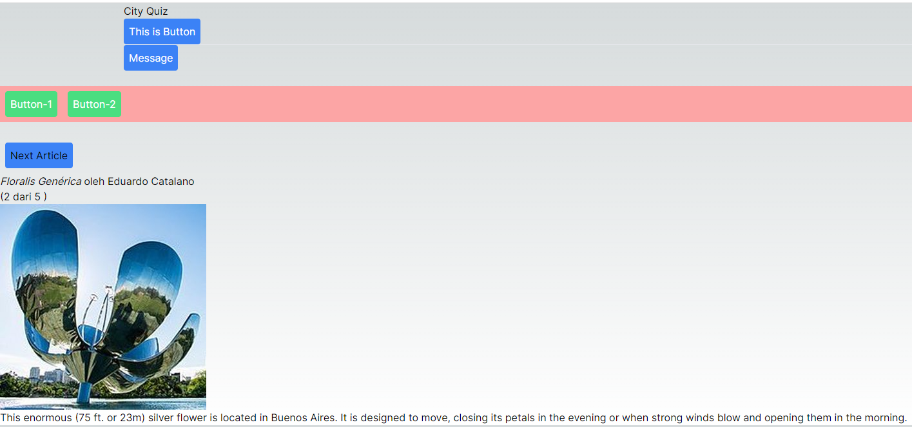
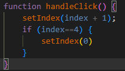
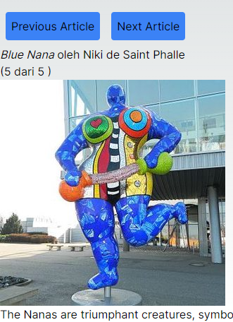
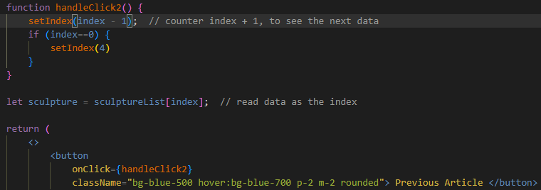
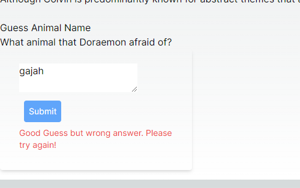
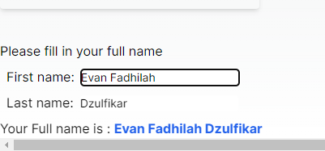

## Laporan Praktikum

|  | Pemrograman Berbasis Framework 2024 |
|--|--|
| NIM |  2141720167|
| Nama |  Evan Fadhilah Dzulfikar |
| Kelas | TI - 3I |

### Practicum 1

 

### Practicum 2

"Try checking in the browser and see what happens?"

"Explain why it is like that?"

    We can see that the button name and the message contents is filled in the page.tsx.
    It is like that because the button is having parameters and taking it from the page.tsx

 

### Practicum 3

 

### Practicum 4

"Question"
"If we press the "Next Article" button 5x (or exceed the total number of article pages), what will happen?"

    It become error because the server couldn't find the next index

"Modify gallery.tsx to handle this problem."

"Add a "Previous Article" button, to display articles backwards."

### Practicum 5

    When we input a wrong answer for the animal, it will display message in the below of submit button.
    If we input the correct answer, nothing happened

"What is the difference between the first Form_2 function and the second?"

    In the first form, there are State for fullName and handler for fullName when we change the First & Last Name
    In the second form, there are no State and Handler. It is changed into normal variable.

"Why is it necessary to delete the fullName state? What are the advantages?"

    Because it is make a redundant state, if we not change it, it will make a bug in the application. 
    The advantages is the application use less computing and become bug-free.

 
