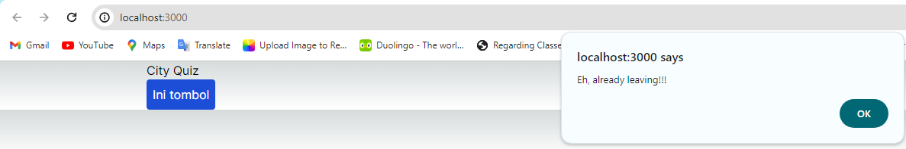
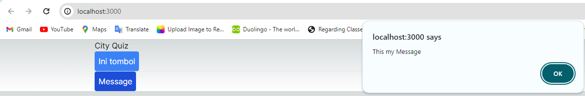

## Laporan Praktikum

|  | Pemrograman Berbasis Framework 2024 |
|--|--|
| NIM |  2141720167|
| Nama |  Evan Fadhilah Dzulfikar |
| Kelas | TI - 3I |

### Practicum 1

 

### Practicum 2

"Try checking in the browser and see what happens?"

"Explain why it is like that?"

    We can see that the button name and the message contents is filled in the page.tsx.
    It is like that because the button is having parameters and taking it from the page.tsx

 

