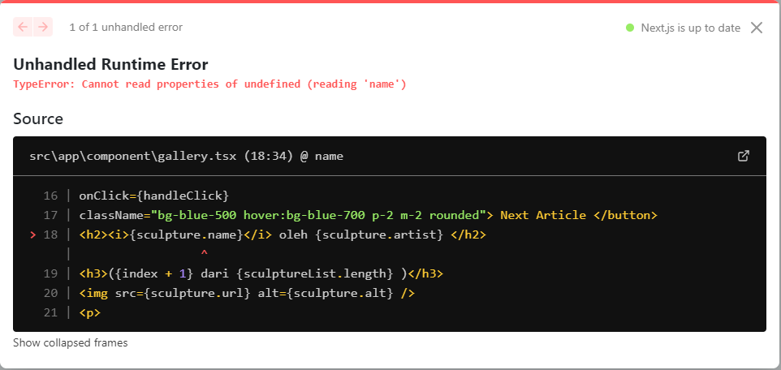

## Laporan Praktikum

|  | Pemrograman Berbasis Framework 2024 |
|--|--|
| NIM |  2141720167|
| Nama |  Evan Fadhilah Dzulfikar |
| Kelas | TI - 3I |

### Practicum 1

 

### Practicum 2

"Try checking in the browser and see what happens?"

"Explain why it is like that?"

    We can see that the button name and the message contents is filled in the page.tsx.
    It is like that because the button is having parameters and taking it from the page.tsx

 

### Practicum 3

 

### Practicum 4

"Question"
"If we press the "Next Article" button 5x (or exceed the total number of article pages), what will happen?"

    It become error because the server couldn't find the next index

"Modify gallery.tsx to handle this problem."

"Add a "Previous Article" button, to display articles backwards."

